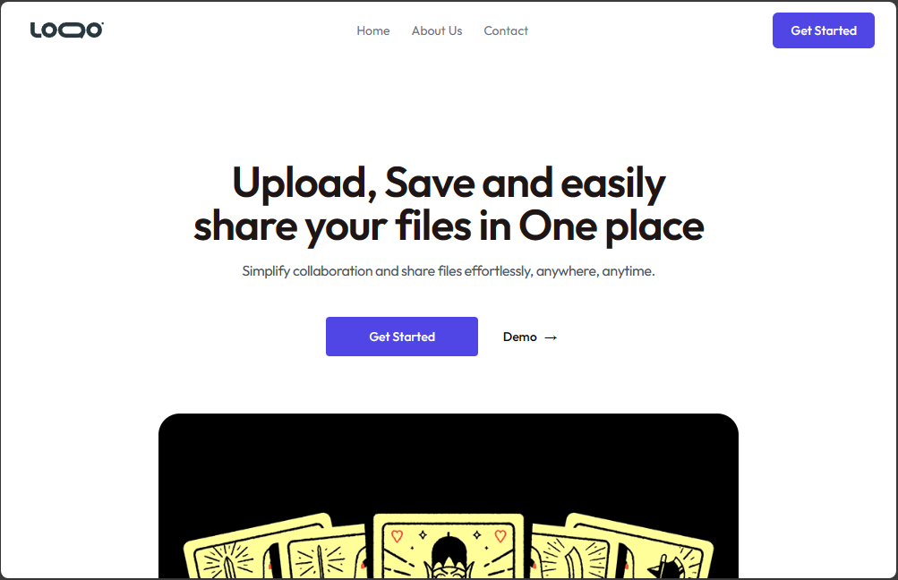

<br/>
<p align="center">
  <h3 align="center">CloudShare Hub</h3>

  <p align="left">
    CloudShare Hub is an innovative and secure file-sharing platform built with cutting-edge technologies to provide users with a seamless and efficient way to share files. The platform harnesses the power of ReactJS and NextJS for a responsive and dynamic user interface, ensuring a smooth and engaging user experience.
    <br/>
    <br/>
    <a href="https://github.com/Ekpo-Emmanuel/Cloud-File-Share"><strong>Explore the docs »</strong></a>
    <br/>
    <br/>
  </p>
</p>

    

## Table Of Contents

* [About the Project](#about-the-project)
* [Key Featues](#key-features)
* [Technologies Used](#technologies-used)
* [Getting Started](#getting-started)
  * [Prerequisites](#prerequisites)
  * [Installation](#installation)
* [Roadmap](#roadmap)
* [Contributing](#contributing)


## About The Project



CloudShare Hub is an innovative and secure file-sharing platform built with cutting-edge technologies to provide users with a seamless and efficient way to share files. The platform harnesses the power of ReactJS and NextJS for a responsive and dynamic user interface, ensuring a smooth and engaging user experience.

Here's why:

* Your time should be focused on creating something amazing. A project that solves a problem and helps others
* You shouldn't be doing the same tasks over and over like creating a README from scratch
* You should element DRY principles to the rest of your life :smile:

Of course, no one template will serve all projects since your needs may be different. So I'll be adding more in the near future. You may also suggest changes by forking this repo and creating a pull request or opening an issue.

A list of commonly used resources that I find helpful are listed in the acknowledgements.

## Technologies Used

This section should list any major frameworks that you built your project using. Leave any add-ons/plugins for the acknowledgements section. Here are a few examples.
* React.js
* Next.js
* Tailwind CSS
* Clerk Authentication
* Firebase
* Google Cloud

## Key features
* Clerk Authentication: prioritizes user security by implementing Clerk authentication. With this robust authentication system, users can trust that their accounts and shared files are protected, and access is granted only to authorized individuals.

* Firebase Integration: Leveraging the capabilities of Firebase, CloudShare Hub ensures real-time updates and synchronization of data across multiple devices. This not only enhances collaboration but also guarantees that users have access to the latest version of shared files.

* Google Cloud Storage: The backbone of CloudShare Hub's file storage infrastructure is powered by Google Cloud. This ensures scalability, reliability, and high-performance file storage, enabling users to seamlessly upload, download, and manage their files.

* Intuitive User Interface: The user interface is designed with ReactJS, NextJS and Tailwind CSS, providing an intuitive and responsive design that adapts to various screen sizes. Users can easily navigate through the platform, upload files, manage folders, and share documents effortlessly.

* Collaborative File Sharing: CloudShare Hub promotes collaboration by allowing users to share files and folders securely. Whether it's for work, school, or personal projects, the platform facilitates seamless collaboration among individuals or teams.

* Real-time Notifications: Users stay informed about their shared files with real-time notifications. Instant updates on file uploads, downloads, and shared folder activities ensure that users are always in the loop.

* Personalized User Profiles: Each user has a personalized profile where they can manage their files, view shared content, and customize their preferences. This enhances the overall user experience and provides a sense of ownership over their shared files.

## Getting Started

### Prerequisites

** Node JS **

### Installation

1. Get a Clerk API Key at [https://clerk.com](https://clerk.com/), 
* firebase API Key at [https://firebase.google.com/](https://firebase.google.com/)

2. Clone the repo

```sh
git clone https://github.com/Ekpo-Emmanuel/Cloud-File-Share
```

3. Run the development server:

```sh
npm run dev
# or
yarn dev
# or
pnpm dev
# or
bun dev
```

Then open [http://localhost:3000](http://localhost:3000) with your browser to see the result.


4. Enter your API in `firebaseConfig.js`
```JS
const firebaseConfig = {
    apiKey: "YOUR_API_KEY",
    authDomain: "YOUR_AUTH_DOMAIN",
    projectId: "YOUR_PROJECT_ID",
    storageBucket: "YOUR_STORAGE_BUCKET",
    messagingSenderId: "YOUR_MESSAGING_SENDER_ID",
    appId: "YOUR_APP_ID",
    measurementId: "YOUR_MEASUREMENT_ID"
};
```

## Roadmap

See the [open issues](https://github.com/Ekpo-Emmanuel/Cloud-File-Share/issues) for a list of proposed features (and known issues).

## Contributing

Contributions are what make the open source community such an amazing place to be learn, inspire, and create. Any contributions you make are **greatly appreciated**.
* If you have suggestions for adding or removing projects, feel free to [open an issue](https://github.com/Ekpo-Emmanuel/Cloud-File-Share/issues/new) to discuss it, or directly create a pull request after you edit the *README.md* file with necessary changes.
* Please make sure you check your spelling and grammar.
* Create individual PR for each suggestion.

### Creating A Pull Request

1. Fork the Project
2. Create your Feature Branch (`git checkout -b feature/AmazingFeature`)
3. Commit your Changes (`git commit -m 'Add some AmazingFeature'`)
4. Push to the Branch (`git push origin feature/AmazingFeature`)
5. Open a Pull Request

<!-- ## License

Distributed under the MIT License. See [LICENSE](https://github.com/Ekpo-Emmanuel/Cloud-File-Share/blob/main/LICENSE.md) for more information. -->

## Author

* **Emmanuel Ekpo** - *Comp Sci Student* 
